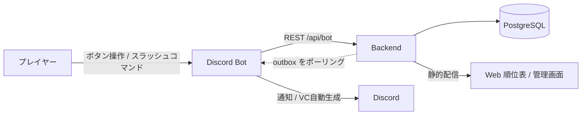

# デュエルアリーナ

Discord上でカードゲームの対戦相手を自動マッチングし、勝敗申告からEloレーティング・シーズン制までを一貫して管理するシステムです。

対戦コミュニティの運営者が手作業で行っていた「対戦相手の組み合わせ」「戦績の集計」「順位表の更新」を自動化することを目的に開発しました。プレイヤーはDiscord上のボタン操作だけで対戦を開始でき、Webサイトを開く必要はありません。

個人開発のプロジェクトです。Backend・Web・Discord Bot の3つを、設計から実装・デプロイまで一人で担当しています。

## システム構成



3つのコンポーネントで構成されています。

| コンポーネント | 役割 | 置き場所 |
|---|---|---|
| Backend | マッチング・レーティング計算・戦績管理を行うAPIサーバー。Webも静的配信する | 本リポジトリ `backend/` |
| Web | 順位表・対戦履歴・イベント戦の閲覧と、管理者向け画面 | 本リポジトリ `web/` |
| Discord Bot | プレイヤーが実際に操作する入口。ボタンUIの提供と試合用チャンネルの自動生成 | [duelarena-bot](https://github.com/hhoriyama/duelarena-bot) |

## 技術スタック

| 領域 | 使用技術 |
|---|---|
| Backend | Node.js 22 / Express / TypeScript / Prisma |
| Web | Vite / React 18 / React Router |
| DB | PostgreSQL (Supabase) |
| Bot | discord.js (別リポジトリ) |
| テスト | Vitest (ユニット / 結合の2層構成) |
| デプロイ | Railway (Docker) + Supabase |

## 主な機能

プレイヤーがキューに参加すると、常駐ワーカーが一定間隔でマッチングを評価し、レーティングが近い相手同士を自動で組み合わせます。直近に対戦した相手とは連続で当たらないよう除外する処理を入れています。

対戦成立後は両者が勝敗を申告し、内容が一致すればEloレーティングが更新されます。申告が食い違った場合は紛争として記録され、管理者が裁定します。申告のないまま40分が経過した対戦は自動的に引き分けとして処理されます。

このほか、シーズン制と称号の付与、期間限定のイベント戦モード、スターレーティング、通報とBANの管理機能を備えています。

## 設計上の工夫

### アウトボックスパターンによるDiscord配信

BackendはDiscordへ直接通知を送らず、配信すべきイベントを`BotOutbox`テーブルに積むだけにしています。Bot側がポーリングで取得し、送信が完了したらackを返す仕組みです。

この構成により、Discord APIの一時障害やBotの再起動が起きても通知が失われません。またBackendがdiscord.jsに依存しなくなるため、Backend単体でのテストが容易になっています。

### Socket.IO依存からの脱却

初期バージョンではDiscord OAuthでWebにログインし、Socket.IOのtickループでマッチングを駆動する構成でした。しかし「対戦のたびにWebを開く」という導線がコミュニティの実態に合わず、Discord内で完結する現在の構成に作り直しています。

マッチングの駆動源も、ソケット接続に依存しない常駐ワーカーへ置き換えました。誰もWebを開いていない状態でもマッチングが進むようになっています。

### テストの2層構成

DBを必要としない純粋なロジック(Eloの計算、マッチング判定、勝敗確定など)のユニットテストと、実際にPostgreSQLへ接続する結合テストを別々の設定ファイルに分離しています。

`npm test`ではユニットテストのみが走るため、DBを立てずに素早く検証できます。結合テストは`npm run test:integration`で個別に実行します。

### 再起動を跨ぐ設定の保持

イベント戦の開催状態などはメモリではなくDBのKVテーブルに保持しているため、Backendが再起動しても状態が維持されます。

## セットアップ

### 前提

Node.js 22以上、Supabaseアカウント、Discord Developer Portalで作成したBotアプリケーションが必要です。

### 手順

```bash
# 1. 依存関係のインストール
npm run install:all

# 2. 環境変数の設定
cp backend/.env.example backend/.env
# backend/.env を編集する。設定項目の説明はファイル内のコメントを参照。
# 最低限 DATABASE_URL と BOT_API_SECRET が必要。

# 3. DBマイグレーション
cd backend
npm run prisma:generate
npm run prisma:migrate
cd ..

# 4. 起動
npm run dev:backend   # ターミナル1: APIサーバー (http://localhost:3001)
npm run dev:web       # ターミナル2: Web開発サーバー
```

Bot側のセットアップは[duelarena-bot](https://github.com/hhoriyama/duelarena-bot)を参照してください。`BOT_API_SECRET`はBackendとBotで同じ値を設定する必要があります。

## テスト

```bash
npm test                              # ユニットテスト (DB不要)
cd backend && npm run test:integration  # 結合テスト (PostgreSQLが必要)
```

## ディレクトリ構成

```
duelarena/
├── backend/
│   ├── src/
│   │   ├── config/         # 環境変数の検証
│   │   ├── lib/            # Prismaクライアントなど
│   │   ├── middleware/     # Bot認証・管理者認証
│   │   ├── routes/         # REST API (bot / public / admin など)
│   │   ├── services/       # マッチング・レーティング・outbox等のロジック
│   │   └── scripts/        # DBリセットなどの運用スクリプト
│   ├── prisma/             # スキーマとマイグレーション
│   └── tests/              # ユニット / 結合テスト
├── web/                    # 順位表・管理画面 (React)
├── shared/                 # 共通の型定義
├── specification.md        # 仕様書
└── DEPLOY.md               # デプロイ手順
```

## ライセンス

MIT License. 詳細は[LICENSE](./LICENSE)を参照してください。
